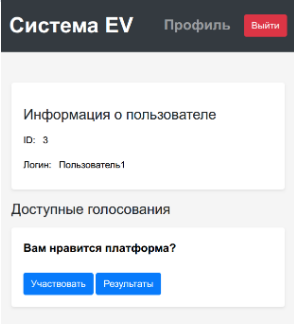

# ev-go

Электронное голосование - система, созданная для безопасного выражения волеизъявления участников голосования.

Является частью "разработка реализации протокола электронного голосования с возможностью проверки учёта голосов"

## Tasks
+ Создать базы данных для каждого компонента в docker-compose
    + ~Создать init.sql~
    + ~Прописать пути к базам данных в конфиги~
    + ~Сделать использование конфигов для каждого компонента~
+ Доразделить IDProvider, Registrar, Tally 
    + ~(разделение кода)~
        + ~Profile страница должна выдаваться Регистратором, данные о себе пользователь выставляет сам~
+ Добавить функционал Tally для реестра бюллетеней 
    + ~Добавление новой бюллетени в реестр~
    + ~Replace бюллетени при переголосовании~
+ Добавить функционал Tally для Merklie-дерева 
    + Понадобится создать скрипт обновления внешнего реестра и Merklie-дерева раз в некоторое время
+ Добавить функционал Registrar для TempID
    + ~Видит~
    + ~Изменяет структуру подписи~
    + Публикует TempID
+ Сделать веб-страницы аудита и проверки голоса для каждого голосования
+ Страницы аппеляций
+ ~QR-код для сохраненного токена~ (partial, требует ссылки проверки голоса)
